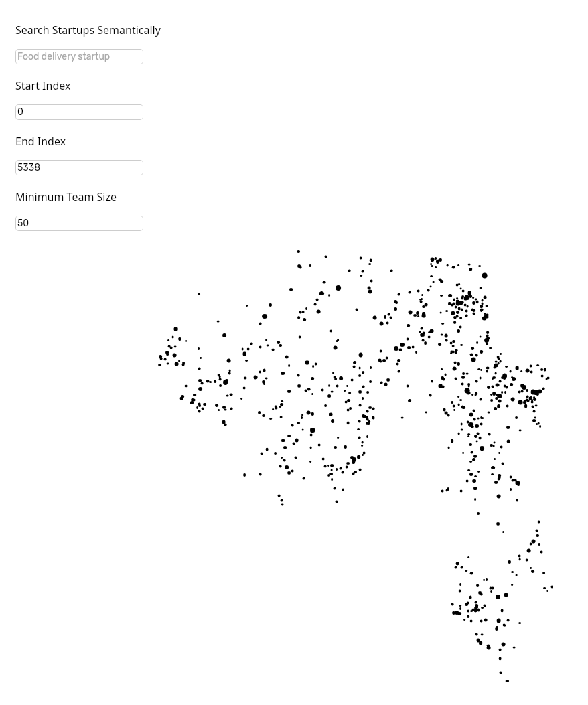
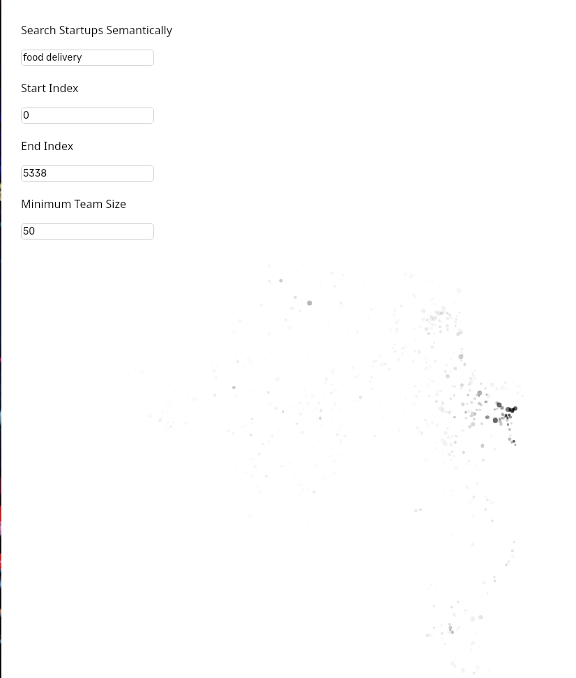
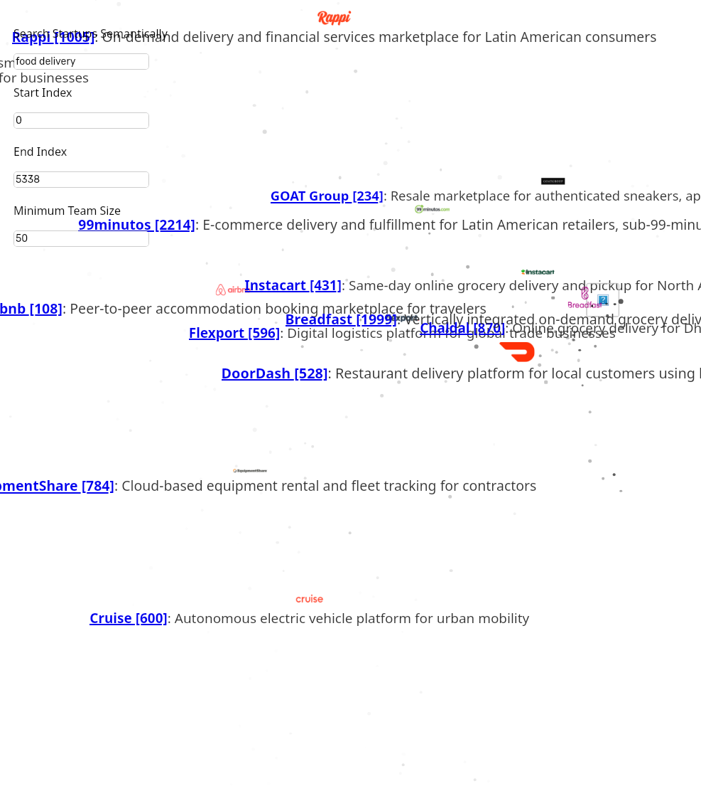

# Startup Map

An interactive visualization of Y Combinator startups plotted on a 2D semantic map based on their descriptions and similarities.

**Live Demo:** [https://patrik-cihal.github.io/startup-map](https://patrik-cihal.github.io/startup-map)

## Overview

Y Combinator startups are positioned using AI embeddings so that companies with similar business models, target markets, or technologies appear closer together on the map.

## Features

### Map Mode (Web + Desktop)
- Pan, zoom, and explore thousands of startups
- Companies filtered by team size based on zoom level
- Smooth 60fps animations

### Search Mode (Desktop only)
- Vector similarity search powered by FastEmbed
- Sort by team size or similarity score
- Logarithmic team size filter, similarity threshold filter
- Compact list view with rank, logo, name, tagline, team size, and match %

## Screenshots







## Architecture

Three-stage pipeline: **scrape -> embed -> visualize**

1. **Scraping** (`scraping/`) — Python with Selenium and BeautifulSoup extracts company data from the YC directory
2. **Embedding** (`embedding/`) — Rust pipeline normalizes taglines (OpenAI), generates 384-dim embeddings (FastEmbed), reduces to 2D (PaCMAP), outputs `startups.json`
3. **Visualization** (`visualization/`) — Dioxus 0.7 app with platform-specific builds:
   - **Desktop**: Full app with Search + Map modes, local FastEmbed for vector search
   - **Web/WASM**: Map mode only (deployed to GitHub Pages)

## Getting Started

### Prerequisites

- Rust (latest stable)
- Dioxus CLI (`cargo install dioxus-cli`)
- Python 3.8+ (for scraping only)
- OpenAI API key (for embedding pipeline only)

### Run the Visualization

**Desktop** (search + map):
```bash
WEBKIT_DISABLE_DMABUF_RENDERER=1 cargo r --release -p visualization
```

**Web** (map only):
```bash
cd visualization
dx serve --platform web
```

### Full Pipeline

```bash
# 1. Scrape (optional — data already included)
cd scraping
pip install -r requirements.txt
python scrape_links.py
python scrape_details.py

# 2. Generate embeddings
echo "OPENAI_API_KEY=your_key" > embedding/.env
cargo r --release -p embedding

# 3. Run visualization
WEBKIT_DISABLE_DMABUF_RENDERER=1 cargo r --release -p visualization
```

## Tech Stack

- **Frontend**: Dioxus (Rust), Tailwind CSS v4, WebAssembly
- **Embeddings**: FastEmbed (384-dim), PaCMAP (dimensionality reduction)
- **Scraping**: Python, Selenium, BeautifulSoup
- **AI**: OpenAI API (tagline normalization)

## License

This project is open source and available under the [MIT License](LICENSE).
